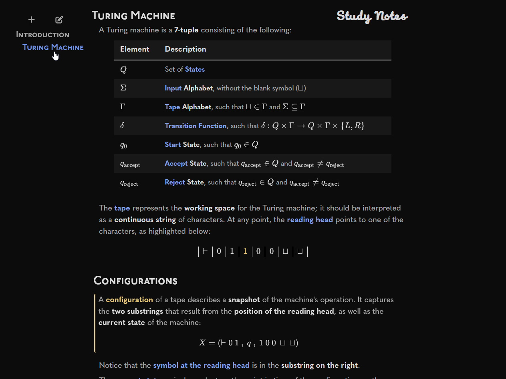
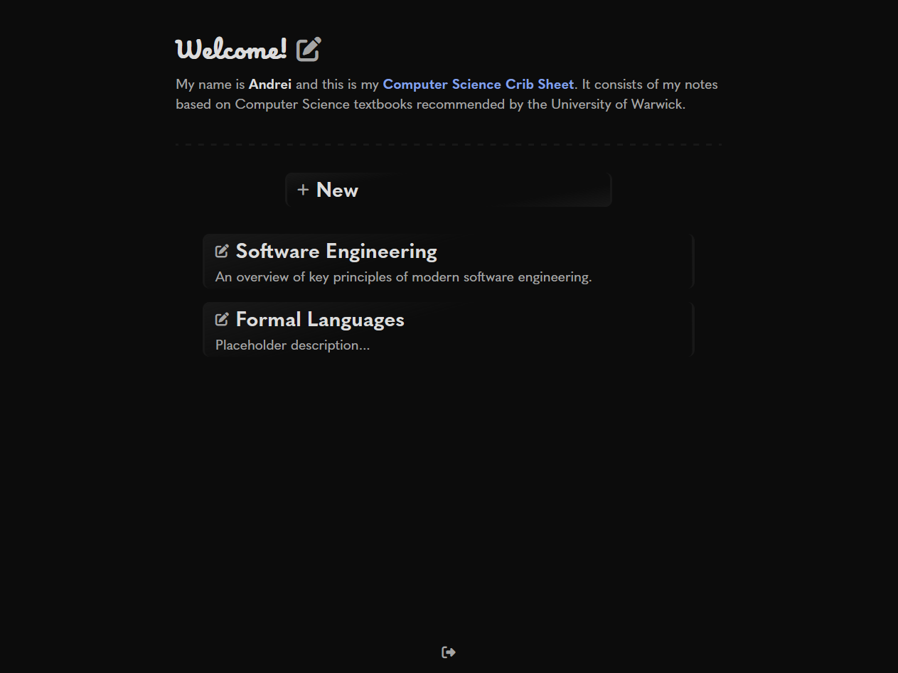

# Notebooks

A simple system for hosting organised notebooks. Once online, all content can be edited in the browser (accessible by signing in), via a fully-custom minimal content-management system powered by **Java Spring** and **PostgreSQL**. The appearance is achieved through the **Java Thymeleaf** template engine for HTML, and vanilla **CSS**.

    

## Features

 * **Markdown** parsing via [Java Flexmark](https://github.com/vsch/flexmark-java):
   * GitHub-flavoured markdown;
   * Custom HTML attributes via `{attribute="value"}` to stylise elements;
   * Custom `<section>` elements to highlight important content.
 * **LaTeX** integration via [KaTeX](https://katex.org/).
 * Custom **in-browser content editor** via [CodeMirror](https://codemirror.net/):
   * Standard editor features such as line-wrap, history, syntax-highlight, and **Vim** bindings enabled;
   * Custom **on-demand preview** for resultant HTML (by clicking the 'eye' button).
   * Custom **LaTeX highlighting** via extensions to the CodeMirror parser and a custom grammar to highlight special symbols.
 * Notebook chapters can be reorganised via simple button navigation.

## Screenshots

